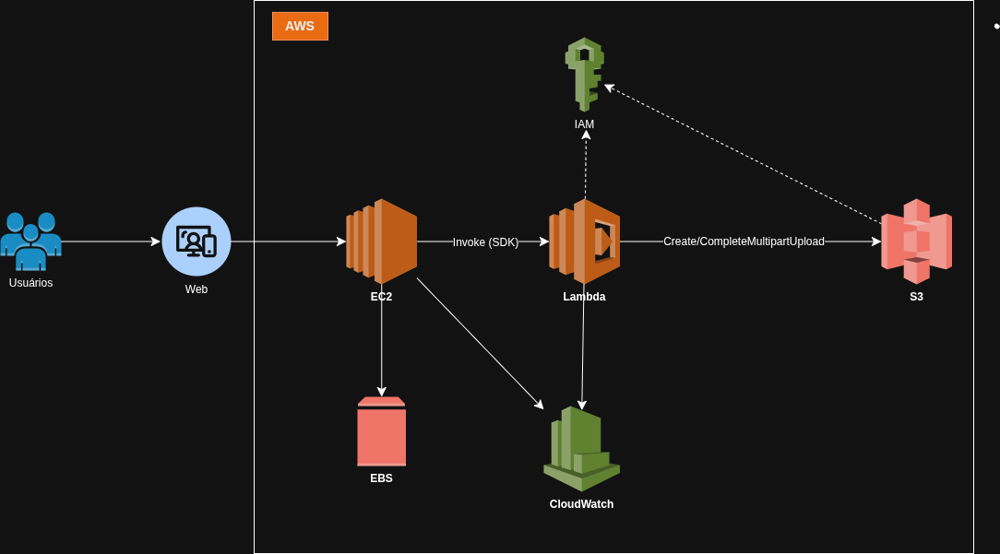

# Gerenciamento de instâncias EC2 na AWS

## Sumário
- [Explicações](#explicações)
  - [O que é S3?](#o-que-é-s3)
  - [O que é EC2?](#o-que-é-ec2)
  - [O que é Lambda Function?](#o-que-é-lambda-function)
  - [O que é EBS?](#o-que-é-ebs)
  - [O que é Amazon CloudWatch?](#o-que-é-amazon-cloudwatch)
  - [O que é IAM?](#o-que-é-iam)
- [Arquitetura](#arquitetura)
  - [Explicação da Arquitetura](#explicação-da-arquitetura)
  - [Componentes Utilizados](#componentes-utilizados)
- [Conceitos Fundamentais](#conceitos-fundamentais)
  - [Regiões](#regiões)
  - [Zonas de Disponibilidade](#zonas-de-disponibilidade)
  - [Serviços gerenciados](#serviços-gerenciados)
  - [AWS Snowball](#aws-snowball)
  - [Práticas de segurança na criação de contas AWS](#práticas-de-segurança-na-criação-de-contas-aws)
  - [Controle de gastos](#controle-de-gastos)
  - [Otimização de recursos na EC2](#otimização-de-recursos-na-ec2)
  - [Formas de acesso à AWS](#formas-de-acesso-à-aws)
- [Fontes](#fontes)
---

## Explicações
### O que é S3?
O Amazon S3 é o serviço de armazenamento de objetos da AWS, onde arquivos ficam em buckets com chave, dados e metadados. É regional, altamente durável e acessível por HTTPS, SDK ou CLI, com políticas IAM, bloqueio de acesso público e criptografia em repouso e em trânsito. Oferece consistência forte para leitura e listagem, versionamento, regras de ciclo de vida, replicação entre regiões e eventos que disparam Lambdas; também pode hospedar site estático. Há classes de armazenamento como Standard, Infrequent Access e Glacier para equilibrar custo e frequência de acesso. A cobrança considera GB armazenado, requisições e saída de dados.

**Tipos por nível de acesso (Frequente a Infrequente)**:

| Classe                     | Uso típico                | Recuperação | Observações                                               |
| -------------------------- | ------------------------- | ----------- | --------------------------------------------------------- |
| Standard                   | Acesso frequente          | ms          | Multi-AZ, maior disponibilidade                           |
| Intelligent-Tiering        | Acesso variável           | ms          | Move camadas automaticamente; pequena taxa de monitoração |
| Standard-IA                | Acesso infrequente        | ms          | Multi-AZ; custo menor + taxa por GB recuperado            |
| One Zone-IA                | Infrequente numa única AZ | ms          | Menor custo e resiliência; risco maior em falha de AZ     |
| Glacier Instant Retrieval  | Raros, mas precisam de ms | ms          | Baixo custo + taxa de recuperação                         |
| Glacier Flexible Retrieval | Arquivo frio              | min–h       | Expedited (minutos), Standard (3–5 h), Bulk (5–12 h)      |
| Glacier Deep Archive       | Longo prazo               | ~12–48 h    | Menor custo de armazenamento; maior tempo de restauração  |

### O que é EC2?
Amazon EC2 é o serviço de computação elástica da AWS que fornece máquinas virtuais (instâncias). Você escolhe tipos de instância (CPU, memória, GPU), imagem de sistema (AMI), rede em VPC e discos como EBS ou armazenamento efêmero. O acesso é via SSH/RDP, com segurança por security groups e IAM. Integra com Auto Scaling para ajustar capacidade automaticamente e com Elastic Load Balancing para distribuir tráfego. Oferece diferentes modelos de preço: On-Demand, Reserved Instances/Savings Plans e Spot. Suporta inicialização automatizada via user data, roles para acessar serviços AWS e monitoramento pelo CloudWatch.

**Modelos de preço**:
On-Demand: paga pelo uso, flexível.
Reservadas / Savings Plans: compromisso de 1–3 anos em troca de desconto (opções de pagamento variam).
Spot: capacidade ociosa com grandes descontos e possível interrupção com aviso curto.

### O que é Lambda Function?
AWS Lambda é um serviço serverless para executar código sem gerenciar servidores. Você envia a função, define memória/timeout e o Lambda escala automaticamente conforme eventos (S3, API Gateway/ALB, EventBridge/CloudWatch Events, DynamoDB Streams, SQS etc.). Cobra por invocações e tempo de execução em milissegundos. As execuções são stateless, com armazenamento efêmero em /tmp e acesso a recursos via IAM; pode rodar dentro de uma VPC. Suporta Layers, variáveis de ambiente e Provisioned Concurrency para reduzir cold start. Limitações incluem tempo máximo por invocação, tamanho do pacote e conexões persistentes.

### O que é EBS?
Amazon EBS (Elastic Block Store) é o armazenamento em blocos da AWS para instâncias EC2 (como um SSD/HDD persistente). Cria volumes na mesma AZ que podem ser anexados/desanexados. Tipos comuns: gp3 (SSD geral), io1/io2 (IOPS provisionado), st1/sc1 (HDD de throughput). Suporta snapshots incrementais (backup/restore) e criptografia nativa (KMS). Performance medida em IOPS e throughput; gp3 permite ajustar IOPS/throughput independentemente do tamanho. Há Multi-Attach (io1/io2) para anexar o mesmo volume a várias instâncias em cenários compatíveis. Cobra por GB-mês, IOPS/throughput provisionados (quando aplicável) e snapshots.

### O que é Amazon CloudWatch?
Amazon CloudWatch é o serviço de observabilidade: coleta e armazena métricas, logs e eventos de serviços como EC2, Lambda e RDS, além de métricas personalizadas. Com CloudWatch Logs e Logs Insights você centraliza e consulta logs; com Alarms define limites para alertas (SNS) ou ações como Auto Scaling. Dashboards exibem gráficos em tempo real. Integra com EventBridge para reagir a eventos e com Synthetics (canários) para testar endpoints periodicamente.

### O que é IAM?
AWS IAM (Identity and Access Management) controla quem pode fazer o quê em quais recursos. Modele identidades com usuários, grupos e funções (roles) e conceda permissões via políticas JSON (menor privilégio). Funções geram credenciais temporárias (STS); há federação/SSO; políticas baseadas em recurso (ex.: bucket policy). Auditoria com CloudTrail e análises com IAM Access Analyzer. Boas práticas: usar roles em vez de chaves, ativar MFA, rotacionar credenciais e separar contas por ambiente.

## Arquitetura

* [Link da Arquitetura](https://drive.google.com/file/d/1fq7w8-xrFz71FnOKIU3bvfAAY42Au6ys/view?usp=drive_link)

### Explicação da Arquitetura
Os usuários enviam arquivos pela aplicação web, a requisição chega na EC2, que hospeda o app e pode usar EBS como armazenamento temporário. A EC2 invoca a Lambda pelo SDK e repassa os dados do upload. A Lambda executa o upload multipart no S3, criando e finalizando as partes para lidar bem com arquivos grandes. O S3 armazena o objeto com alta durabilidade. Logs e métricas de EC2 e Lambda são enviados ao CloudWatch para monitoramento. As permissões são controladas por IAM, permitindo à EC2 chamar a Lambda e à Lambda escrever no S3. Neste fluxo o gatilho é a EC2 chamando a Lambda, não um evento do S3.

### Componentes Utilizados

| Usuário (Cliente) | Origem das requisições para a aplicação.            |
|-------------------|-----------------------------------------------------|
| Sistema Web       | Sistema que recebe os arquivos                      |
| Amazon EC2        | Instância da máquina virtual                        |
| Amazon EBS        | Armazenamento temporário da instância EC2           |
| Amazon Lambda     | Servidor serverless                                 |
| Amazon CloudWatch | Monitoramento das requisições e da máquina virtual. |
| Amazon S3         | Armazenamento de arquivos.                          |
| Amazon IAM        | Controle de permissões.                             |

## Conceitos Fundamentais
### Regiões
Cada região é projetada para ser isolada das outras regiões. O que proporciona uma maior tolerância a falhas e estabilidade possível.
Uma região é composta por 2 ou mais zonas de disponibilidade.

**Regiões são áreas geográficas contendo várias zonas de disponibilidade.**

*Zonas de disponibilidade: São data centers independentes fisicamente, mas conectados logicamente, para garantir alta disponibilidade.*

Pontos que devemos levar em consideração quando escolhermos uma região:

- Disponibilidade de serviço
- Compliance
- Custo
- Latência

### Zonas de Disponibilidade
Cada região é independente das demais regiões, o que significa que os recursos são exclusivos da região escolhida em que está sendo provisionado os recursos.
Isto contribui para maior tolerância a falhas e não há replicação automática entre regiões, isso deve ser implementado pelo administrador da conta.

### Serviços gerenciados

São serviços que a amazon assume boa parte da operaçao da infraestrutura e software base. Para que foquemos no uso do serviço.

### AWS Snowball
O AWS Snowball serve **para transferir grandes volumes de dados (terabytes ou petabytes) de forma física para dentro e fora da nuvem da AWS**

### Práticas de segurança na criação de contas AWS

1. Criar conta root e depois guardar
2. Não compartilhar dados da conta
3. Ficar atento ao e-mail com as cobranças
4. Autenticação Multifator
5. Estabelecer barreiras de proteção para permissões

### Controle de gastos
É possível colocar alertas sobre custos.

**Governança e visibilidade**
AWS Budgets: Define orçamento mensal e alertas
Cost explorer: analisa onde o dinheiro vai
Cost e Usage Report (CUR): nível “centavo por linha”, integra com Athena/Quicksight.
Cost Categories: agrupa custos por “ambiente”, “time”, “produto”.
Tags + Cost Allocation Tags: garante Environment, Owner, Project. Atividades para cobrança.
Anomaly Detection: alerta de desvios atípicos.

**Prevenção e guardrails**
AWS Organizations + SCPs: bloqueia serviços/regiões caras, cria limites
Permission Boundaries: limita teto de permissão para quem cria recursos.
Service Quotas: limites por serviço ajudam a evitar estouros por acidente.
CloudWatch Billing Alarms: alarme por valor de fatura

**Estratégia de contas e ambientes**
- Separe contas por ambiente
- Padronize nomenclatura e tags
- Centralize o billing na payer account e aplique SCPs de guardrails

**O que é guardrails?**
São regras técnicas e organizacionais que impõem limites automáticos para que o uso da nuvem/serviços se mantenha seguro, conforme e econômico.
Tipos:
- Preventivos (bloqueiam antes de acontecer)
- Detetivos (monitoram e alertam/corrigem)

**Otimização de recursos na EC2**
Como poupar na EC2?
- Desligando instâncias não utilizadas
- Remover recursos ociosos ou não utilizados
- Escalar recursos
    - Podemos escalar horizontalmente ou verticalmente

**Escalar verticalmente**
Significa acrescentar ou reduzir capacidade de um recurso em um mesmo nó e geralmente está relacionado a alterar o número de vCPUs, memória, storage, rede de uma instância.

**Escalar horizontalmente**
Significa aumentar o número de recursos. Por exemplo, adicionando mais um disco rígido, adicionando mais uma instância para suportar a aplicação.

**Tipos de instância EC2**
Sob demanda → As instâncias on-demand são compradas a uma taxa fixa por hora e são recomendadas para aplicativos com carga de trabalho irregulares de curto prazo que não podem ser interrompidas.

Instâncias reservadas → São mais baratas que as sob demanda, mas precisa pagar o ano inteiro de uso (1 a 3 anos).

Instâncias Spot →Garante a disponibilidade das aplicações sob demanda com descontos de até 90%. A desvantagem é que elas podem ser encerradas pela AWS a qualquer momento com um aviso de dois minutos.

### Formas de acesso à AWS
AWS CLI - Máquina local, ferramenta de linha de comando para scriptar e automatizar.
AWS CloudShell - Terminal no navegador, é um shell Linux dentro do Console, já com AWS CLI e SDKs instalados.
Console AWS - Painel gráfico no navegador, fácil de usar.

## Fontes
* [Amazon S3](https://aws.amazon.com/pt/s3/)
* [Amazon EC2](https://docs.aws.amazon.com/pt_br/toolkit-for-visual-studio/latest/user-guide/tkv-ec2-ami.html)
* [Amazon EBS](https://aws.amazon.com/pt/ebs/)
* [AWS Lambda](https://aws.amazon.com/pt/lambda/)
* [Amazon CloudWatch](https://aws.amazon.com/pt/cloudwatch/)
* [AWS IAM](https://aws.amazon.com/pt/iam/)
* [Global Infrastructure](https://aws.amazon.com/pt/about-aws/global-infrastructure/regions_az/)
* [Hexagonal Architectures – AWS Prescriptive Guidance](https://docs.aws.amazon.com/pt_br/prescriptive-guidance/latest/hexagonal-architectures/examples.html)
