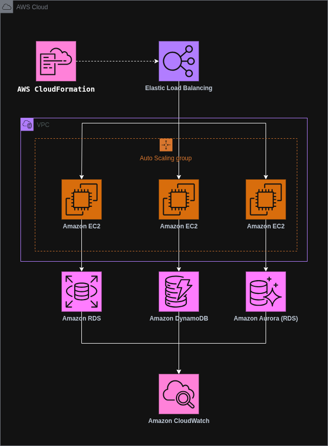

# AWS CloudFormation (Desafio 3 — Bootcamp Santander Code Girls 2025)

## Sumário
- [Explicações](#explicações)
  - [O que é AWS CloudFormation?](#o-que-é-aws-cloudformation)
  - [O que é JSON?](#o-que-é-json)
  - [O que é YAML?](#o-que-é-yaml)
- [Arquitetura](#arquitetura)
  - [Explicação da Arquitetura](#explicação-da-arquitetura)
  - [Componentes Utilizados](#componentes-utilizados)
- [Conceitos Fundamentais](#conceitos-fundamentais)
  - [Como criar stacks no AWS CloudFormation?](#como-criar-stacks-no-aws-cloudformation)
  - [Como criar stacks de Firewall no AWS CloudFormation?](#como-criar-stacks-de-Firewall-no-aws-cloudformation)
- [Fontes](#fontes)
---

## Explicações

### O que é AWS CloudFormation?
AWS CloudFormation é o serviço de Infraestrutura como Código nativo da AWS que permite modelar, provisionar e gerenciar recursos de forma declarativa usando templates em YAML ou JSON. Você descreve o ambiente em um arquivo, envia esse template e o CloudFormation cria uma “stack” com todos os recursos na ordem correta, aplica dependências, registra o estado e oferece rollback automático se algo falhar. Ele suporta parâmetros, condições, saídas e referências entre recursos, além de Change Sets para pré-visualizar alterações, Drift Detection para detectar desvios do que foi declarado e StackSets para implantar a mesma stack em várias contas e regiões.

### O que é JSON?
JSON (JavaScript Object Notation) é um formato baseado em texto, para representar e trocar dados estruturados entre sistemas. É independente de linguagem e muito usado em APIs, arquivos de configuração e logs. Os dados são organizados em objetos {chave: valor} e arrays [...]. Tipos válidos: string, number, boolean, null, object e array. Regras importantes: chaves e strings com aspas duplas, nada de comentários, nada de vírgulas finais, normalmente codificado em UTF-8.

### O que é YAML?
YAML (“YAML Ain’t Markup Language”) é um formato de serialização de dados legível, muito usado em arquivos de configuração, CI/CD e IaC como AWS CloudFormation. A estrutura é definida por indentação com espaços, não usa chaves ou vírgulas, permite comentários com #, strings multilinha e recursos poderosos como âncoras (&) e aliases (*) para reutilizar trechos. Representa mapas, listas e escalares de forma simples e direta.

## Arquitetura

* [Link da Arquitetura](https://drive.google.com/file/d/1zHCKv83K2FYOnzv0eMjm6r2bY1wYpk3h/view?usp=sharing)

### Explicação da Arquitetura
Meu diagrama representa uma stack que eu provisiono com AWS CloudFormation para um ambiente web escalável e observável. Eu recebo o tráfego no Elastic Load Balancing e o distribuo para instâncias Amazon EC2 dentro da VPC, organizadas em um Auto Scaling Group para lidar com picos e garantir alta disponibilidade. Eu isolo a rede na VPC e controlo o fluxo entre camadas. Na persistência, eu combino Amazon RDS e Amazon Aurora (RDS) para cargas relacionais e adiciono Amazon DynamoDB para dados não relacionais de baixa latência, adotando uma estratégia de persistência poliglota. As EC2 acessam cada banco conforme a necessidade da aplicação. Eu centralizo métricas, logs e alarmes no Amazon CloudWatch para observabilidade e operação contínua. As setas mostram o caminho da requisição do balanceador às EC2 e destas às camadas de dados, enquanto o CloudFormation padroniza a criação e a atualização dos recursos. O resultado é uma arquitetura padronizada, resiliente, escalável e pronta para crescer com segurança e visibilidade.

### Componentes Utilizados

| Serviço               | Descrição                                           |
|-----------------------|-----------------------------------------------------|
| CloudFormation        | Serviço de infraestrutura como código (IaC)         |
| Elastic Load Balancing| Distribui automaticamente o tráfego                 |
| Amazon VPC            | Ambiente de rede virtual isolado                    |
| Auto Scaling Group    | Coleção lógica de instâncias do Amazon EC2          |
| Amazon RDS            | Banco de dados relacional                           |
| Amazon DynamoDB       | Banco de dados não relacional                       |
| Amazon Aurora         | Banco de dados relacional em escala global          |
| Amazon CloudWatch     | Monitoramento dos recursos                          |

## Conceitos Fundamentais
### Como criar stacks no AWS CloudFormation?
1. No Console da AWS, abra CloudFormation e clique em Create stack → With new resources.
2. Em Specify template, faça upload do template YAML/JSON ou indique a URL no S3.
3. Dê um nome para a stack, informe parâmetros, tags e, se houver recursos IAM, marque as capacidades.
4. Revise as opções de rollback, observabilidade e stack policy se precisar proteger recursos críticos.
5. Crie a stack e acompanhe em Events; ao concluir, consulte Outputs.

### Como criar stacks de Firewall no AWS CloudFormation?
**AWS WAF**
1. Defina alvo e escopo (Regional para ALB/API Gateway, CloudFront em us-east-1).
2. Selecione rule groups gerenciados e eventuais IP sets, defina prioridades e ação padrão.
3. Ative métricas e logs.
4. Parametrize o ARN do alvo, associe o WebACL.
5. Valide com Change Set, aplique, monitore e ajuste exceções.

**AWS Network Firewall**
1. Defina o tráfego a inspecionar e desenhe subnets dedicadas em múltiplas AZs.
2. Modele rule groups stateless e stateful e, se necessário, inspeção TLS.
3. Crie a policy referenciando os rule groups.
4. Provisione o Firewall na VPC e habilite logs.
5. Ajuste route tables para encampar o tráfego com retorno simétrico.
6. Valide com Change Set, aplique, monitore métricas e revisite regras e custos.

## Fontes
* [AWS CloudFormation](https://docs.aws.amazon.com/whitepapers/latest/introduction-devops-aws/aws-cloudformation.html)
