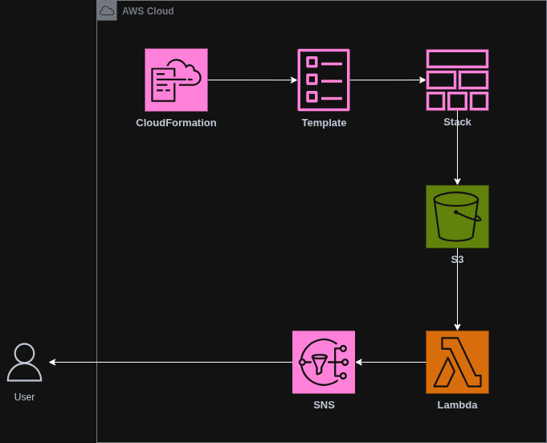

# AWS CloudFormation (Desafio 4 — Bootcamp Santander Code Girls 2025)

## Sumário
- [Explicações](#explicações)
  - [O que é AWS CloudFormation?](#o-que-é-aws-cloudformation)
  - [O que é Terraform?](#o-que-é-terraform)
  - [AWS CloudFormation x Terraform](#aws-cloudformation-x-terraform)
- [Arquitetura](#arquitetura)
  - [Explicação da Arquitetura](#explicação-da-arquitetura)
  - [Componentes Utilizados](#componentes-utilizados)
- [Conceitos Fundamentais](#conceitos-fundamentais)
  - [Benefícios do AWS CloudFormation](#benefícios-do-aws-cloudFormation)
  - [Criando uma stack no cloudFormation](#criando-uma-stack-no-cloudFormation)
- [Fontes](#fontes)
---

## Explicações

### O que é AWS CloudFormation?
O AWS CloudFormation é um serviço que facilita a modelagem e configuração de recursos na AWS. É onde criamos modelos que descrevem os recursos necessários, como instâncias EC2 ou bancos de dados RDS, automatizando seu provisionamento e configuração.
Com o CloudFormation eliminamos a necessidade de configurar recursos manualmente, permitindo que possamos focar no desenvolvimento e gestão dos aplicativos.

### O que é Terraform?
Terraform é uma ferramenta de Infraestrutura como Código (IaC) open source da HashiCorp que permite definir, versionar e provisionar recursos de nuvem de forma declarativa em múltiplos provedores como AWS, Azure e GCP. Você descreve a infraestrutura em arquivos .tf usando HCL, gera um plano que mostra o que vai mudar e aplica para criar ou atualizar os recursos. Um arquivo de estado registra o que existe, garantindo idempotência e detecção de drift, e pode ficar remoto em S3 com bloqueio via DynamoDB. Com módulos e variáveis, você reutiliza padrões de arquitetura e reduz erros. O grafo de dependências organiza a ordem de criação automaticamente.

### AWS CloudFormation x Terraform
CloudFormation e Terraform resolvem o mesmo problema com caminhos diferentes. CloudFormation é nativo da AWS, conversa profundamente com os serviços, mantém o estado dentro da própria plataforma, oferece Change Sets para pré visualização e facilita governança com IAM, Stack Policies e StackSets. É a escolha natural quando o ecossistema é cem por cento AWS, a segurança passa por contas bem separadas e você quer auditoria central sem administrar arquivos de estado. Terraform é uma ferramenta de infraestrutura como código da HashiCorp que atua em múltiplos provedores, usa HCL para descrever recursos, cria um plano claro antes de aplicar e guarda o estado de forma controlada em locais como S3 com bloqueio no DynamoDB. O ponto forte é o ecossistema de providers e módulos reutilizáveis que padronizam ambientes entre times e nuvens. Em termos práticos, CloudFormation brilha em integrações finas com serviços gerenciados e políticas da própria AWS, enquanto Terraform acelera fundações de contas, redes e integrações externas mantendo portabilidade. Muitas equipes combinam os dois, usando Terraform para a base comum e CloudFormation ou CDK para peças específicas da AWS. Se a prioridade é governança nativa e simplicidade operacional dentro da AWS, escolha CloudFormation. Se a prioridade é reutilização ampla, velocidade e desenho multinuvem, escolha Terraform.

## Arquitetura

* [Link da Arquitetura](https://drive.google.com/file/d/1ea_s6EL3zq4goQxsGmco9JvJmDoVCrEd/view?usp=sharing)

### Explicação da Arquitetura
Eu provisiono tudo com AWS CloudFormation. Começo escrevendo um template declarativo e, ao criar a stack, a AWS entrega os recursos exatamente como defini: um bucket S3, uma função Lambda e um tópico SNS. Em tempo de execução, quando eu envio um arquivo para o S3, o evento de criação dispara a Lambda. A função lê o objeto, valida metadados, processa o que for necessário e publica um resumo no SNS. O SNS distribui a notificação para os assinantes e eu recebo o alerta por e-mail ou webhook, confirmando que o processamento ocorreu. Em segurança, aplico mínimo privilégio para que somente o S3 possa invocar a Lambda e apenas a Lambda publique no SNS, com o bucket bloqueado para acesso público e criptografia habilitada. Como tudo nasce do template, eu versiono a infraestrutura, reviso mudanças com Change Sets e faço updates controlados na stack, mantendo o ambiente reproduzível, auditável e fácil de evoluir.

### Componentes Utilizados

| Serviço            | Descrição                                                                   |
| ------------------ | --------------------------------------------------------------------------- |
| AWS CloudFormation | Infraestrutura como código; cria a stack com S3, Lambda e SNS               |
| Amazon S3          | Armazenamento de objetos e origem de eventos que disparam a Lambda          |
| AWS Lambda         | Processamento serverless do arquivo do S3 e publicação de resultados no SNS |
| Amazon SNS         | Tópico de notificação para distribuir mensagens a assinantes                |

## Conceitos Fundamentais
### Benefícios do AWS CloudFormation
- Automação → O AWS CloudFormation ajuda a automatizar o processo de criação, configuração e gerenciamento de recursos da AWS.
- Economia de custos → O AWS CloudFormation ajuda a reduzir custos permitindo que os clientes reutilizem modelos de infraestrutura em vários ambientes.
- Segurança → O AWS CloudFormation ajuda a garantir que todos os recursos da AWS sejam configurados com segurança utilizando políticas e regras de segurança.

### Criando uma stack no cloudFormation
1. Entre no console da AWS
2. Selecione o serviço CloudFormation
3. Clique em Create Stack
4. Selecione o template e selecione o LAMP Stack
5. Projete sua infraestrutura
6. Clique no botão de upload em forma de nuvem para sair do designer

## Fontes
* [AWS CloudFormation](https://docs.aws.amazon.com/whitepapers/latest/introduction-devops-aws/aws-cloudformation.html)
* [Terraform](https://developer.hashicorp.com/terraform)