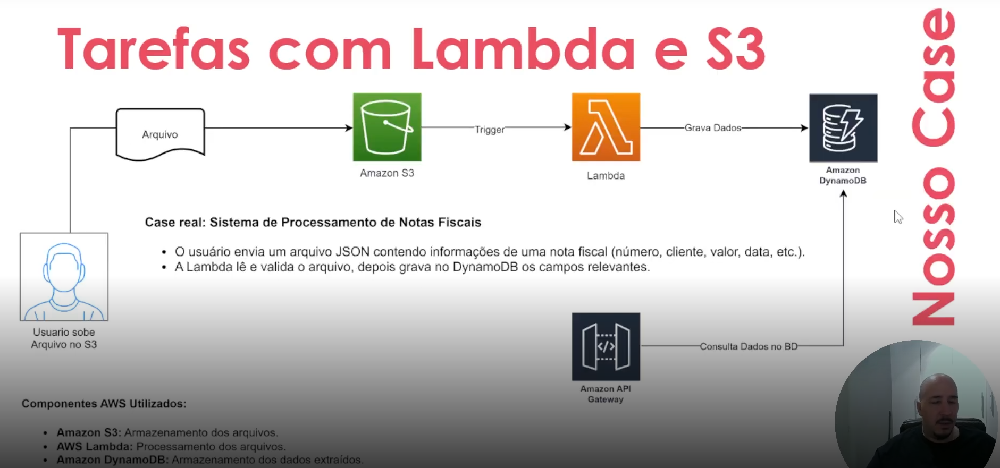
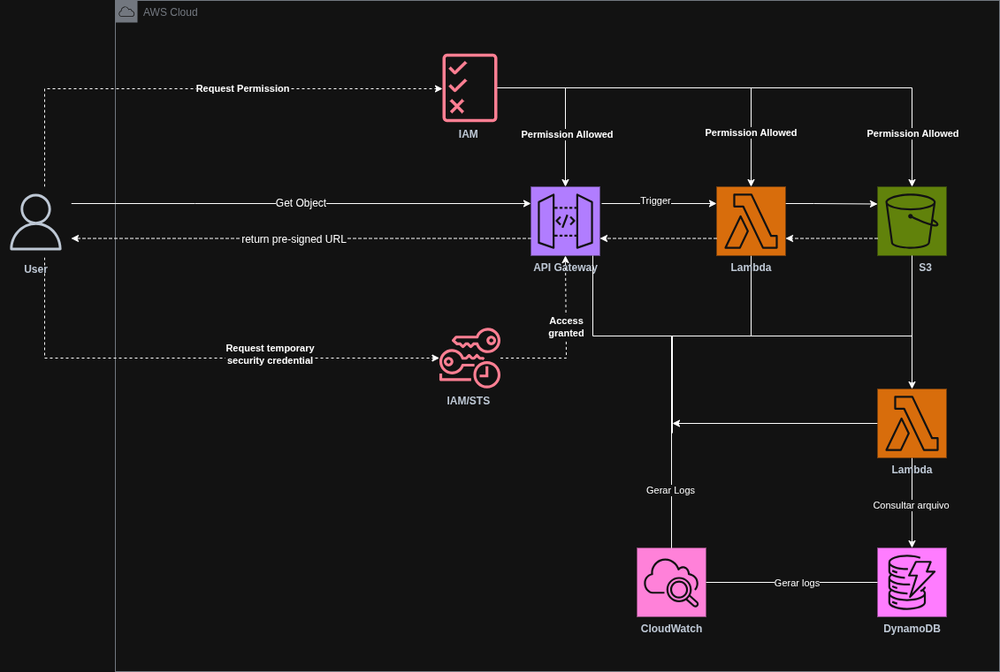

# Automação com AWS Lambda e Amazon S3 (Desafio 05 — Bootcamp Santander Code Girls 2025)

## Sumário
- [Explicações](#explicações)
  - [O que é AWS Lambda?](#o-que-é-aws-lambda)
  - [O que é Amazon S3?](#o-que-é-amazon-s3)
  - [O que é DynamoDB?](#o-que-é-dynamodb)
  - [O que é API Gateway?](#o-que-é-api-gateway)
  - [O que é CloudWatch?](#o-que-é-cloudwatch)
  - [AWS Local com LocalStack](#aws-local-com-localstack)
- [Caso de uso da aula](#caso-de-uso-da-aula)
- [Arquitetura](#arquitetura)
  - [Explicação da Arquitetura](#explicação-da-arquitetura)
  - [Componentes Utilizados](#componentes-utilizados)
- [Conceitos Fundamentais](#conceitos-fundamentais)
  - [Como configurar AWS localmente com LocalStack](#como-configurar-aws-localmente-com-localstack)
  - [Como criar recursos utilizando LocalStack](#como-criar-recursos-utilizando-localstack)
  - [Como trabalhar arquivos localmente com LocalStack](#como-trabalhar-arquivos-localmente-com-localstack)
- [Fontes](#fontes)
---

## Explicações

### O que é AWS Lambda?
É um serviço de computação serverless que permite executar código em resposta a eventos, sem a necessidade de gerenciar servidores. Basta fazer o upload do código e o Lambda se encarrega de executar automaticamente, escalando conforme a demanda.
Principais vantagens:
- Execução sob demanda → O código executa apenas quando necessário.
- Escalabilidade automática → Ajusta automaticamente a capacidade.
- Custo eficiente → Cobra apenas pelo tempo de execução e pela quantidade de solicitações.
- Integração com outros serviços AWS → Funciona como um conector entre diversos serviços da AWS, como S3, DynamoDB, API Gateway.

### O que é Amazon S3?
Amazon S3 é um serviço de armazenamento em nuvem que permite “armazenar e acessar” dados de forma segura e escalável. Ele suporta qualquer tipo de arquivo (vídeo, áudio, imagens, documentos, etc.) e é ideal para backup e armazenamento de objetos.
Principais vantagens:
- Durabilidade → Altamente confiável.
- Disponibilidade → Garante acesso contínuo aos dados.
- Escalabilidade → Ajusta automaticamente a capacidade de armazenamento conforme a necessidade.
- Segurança → Oferece criptografia, controle de acesso e monitoramento de atividades.

### O que é DynamoDB?
Amazon DynamoDB é um banco de dados NoSQL totalmente gerenciado da AWS, orientado a chave-valor e documentos, projetado para latências de milissegundos e escala praticamente ilimitada. Ele não exige esquema fixo: você modela dados em torno da chave primária (partition key e, opcionalmente, sort key) e consulta por padrões bem definidos. Oferece capacidade sob demanda ou provisionada com auto scaling, índices secundários globais e locais, Streams para eventos, TTL, transações ACID, backups e recuperação point-in-time, criptografia com KMS e controle de acesso via IAM, além de integração nativa com Lambda. Use quando precisar de alto throughput e acesso direto por chave.
Principais vantagens:
- Desempenho em milissegundos → Leituras e gravações com latência consistentemente baixa.
- Escalabilidade automática → Modos sob demanda e provisionado com auto scaling conforme o tráfego.
- Alta disponibilidade → Replicação automática entre múltiplas zonas de disponibilidade.
- Gerenciado e serverless → Sem servidores para operar, sem sharding manual ou patches.
- Índices flexíveis → GSIs e LSIs para atender múltiplos padrões de consulta.
- Consistência configurável → Escolha entre leitura eventual ou forte por operação.
- Transações ACID → Operações atômicas envolvendo múltiplos itens e tabelas.
- Eventos em tempo real → DynamoDB Streams integradas a Lambda e Kinesis.
- Segurança → Criptografia com KMS, controle de acesso via IAM e VPC endpoints.
- Recuperação e retenção → Backups sob demanda, Point-in-Time Recovery e TTL para expurgo automático.
- Global Tables → Replicação ativa-ativa entre regiões para baixa latência global.
- Custo previsível → Pague por capacidade ou por requisição com controle fino de throughput.

### O que é API Gateway?
O Amazon API Gateway é um serviço gerenciado da AWS que funciona como porta de entrada para APIs. Ele recebe as requisições de clientes web ou mobile, aplica autenticação e autorização, limita tráfego, transforma, valida payloads e encaminha as chamadas para backends como Lambda, EC2/ECS, ou outros serviços da AWS e no fim, retorna a resposta ao cliente com observabilidade e métricas nativas.
Principais vantagens:
- Autenticação e autorização → Integra com IAM, Cognito (JWT) e Lambda Authorizer para proteger endpoints.
- Controle de tráfego → Throttling e quotas por API key para evitar abusos e isolar consumidores.
- Transformação e validação → Mapeia e valida payloads, path/queries e headers antes de chegar ao backend.
- Integração serverless → Aciona Lambda, Step Functions e serviços AWS com baixa configuração.
- Observabilidade → Logs e métricas nativos no CloudWatch e tracing com X-Ray.
- Caching e performance → Cache gerenciado por estágio, reduz latência e custo de backend.
- Versionamento e ambientes → Stages (dev/hml/prod), deploys controlados e rollbacks.
- Segurança na borda → Domínio customizado com ACM, WAF, mTLS e suporte a CORS.
- Escalabilidade e alta disponibilidade → Serviço gerenciado que escala automaticamente.

### O que é CloudWatch?
O Amazon CloudWatch é o serviço gerenciado de monitoramento e observabilidade da AWS. Ele coleta e unifica métricas, logs e traces de serviços da AWS, containers e aplicações on-premise, permitindo dashboards, alarmes e ações automáticas (ex.: enviar para SNS, acionar Auto Scaling, abrir incidentes).
Principais vantagens:
- Observabilidade unificada → Métricas, logs, traces e eventos no mesmo lugar.
- Alertas acionáveis → Alarmes com ações automáticas via SNS, Auto Scaling e Lambda.
- Dashboards em tempo real → Visualização rápida da saúde e do desempenho.
- Detecção de anomalias → Limiares dinâmicos que se ajustam ao histórico.
- Integração nativa com AWS → Coleta automática de serviços, containers e aplicações.
- Escalabilidade gerenciada → Monitora grandes volumes sem servidores para operar.
- Troubleshooting distribuído → ServiceLens e X-Ray rastreiam dependências e latência.
- Custo sob controle → Retenção configurável e filtros/consultas eficientes em Logs.
- Experiência do usuário → Synthetics e RUM monitoram disponibilidade e front-end.
- Multi-conta e multirregião → Painéis e alarmes centralizados em ambientes complexos.

### AWS Local com LocalStack
LocalStack é um projeto open source que simula serviços da AWS no seu ambiente local. Com ele, você desenvolve, testa e integra aplicações que usam S3, DynamoDB, Lambda, CloudFormation e muitos outros sem acessar a nuvem real nem gerar custos, ideal para ciclos rápidos e pipelines de CI/CD. A edição Community é gratuita e cobre a maioria dos cenários; as versões Pro e Enterprise acrescentam recursos avançados, como emulação mais fiel, ferramentas de produtividade e suporte a endpoints de rede personalizados. O resultado é um fluxo de trabalho mais veloz, previsível e offline, usando o mesmo SDK e a mesma CLI da AWS.

---

## Caso de uso da aula
**Upload de arquivos com processamento e registro no DynamoDB**

1. O usuário faz upload de um arquivo (CSV ou JSON) em um bucket S3.
2. Um evento no S3 dispara uma Lambda Function escrita em Python.
3. A Lambda processa o conteúdo do arquivo e grava esses dados em uma tabela no DynamoDB.
4. Outra função Lambda consulta a tabela e expõe os dados por meio de uma API Gateway.

*Caso de uso abordado em aula, por esse motivo é de um fluxo diferente.*

---

## Arquitetura

* [Link da Arquitetura](https://drive.google.com/file/d/1C36nyL3P1gmEhqbFu8m_RtR5VDdJipcu/view?usp=sharing)

### Explicação da Arquitetura
Projetei esta arquitetura para entregar objetos do Amazon S3 com segurança, desempenho e baixo custo. O fluxo começa quando o usuário chama minha API no API Gateway. O authorizer e as políticas do IAM avaliam a solicitação e, se aprovada, o Gateway invoca a função Lambda. Em vez de trafegar o arquivo pela API, gero uma URL pré-assinada de curta duração com permissão apenas de leitura. Devolvo essa URL ao cliente e o download ocorre diretamente do S3, reduzindo latência, custo e evitando exposição de dados na aplicação. Quando preciso conceder acesso direto, emito credenciais temporárias via IAM e STS com políticas restritas por prefixos ou tags. A observabilidade fica garantida com logs do API Gateway e da Lambda no CloudWatch Logs e com uma Lambda de auditoria que reage a eventos do S3 e grava metadados no DynamoDB. Em resumo, valido no IAM, autorizo na Lambda, retorno a URL pré-assinada, o cliente conversa diretamente com o S3 e toda a jornada permanece auditável e mensurável.

### Componentes Utilizados

| Serviço                | Descrição                                                                                                      |
| ---------------------- | -------------------------------------------------------------------------------------------------------------- |
| AWS IAM                | Controle de acesso e avaliação de políticas; roles para API Gateway, Lambda e S3, além de bucket policy.       |
| AWS STS (IAM/STS)      | Emissão de credenciais temporárias para o cliente com escopo restrito por prefixos ou tags no S3.              |
| Amazon API Gateway     | Porta de entrada da API; authorizer valida a chamada, invoca a Lambda e retorna a URL pré-assinada ao cliente. |
| AWS Lambda (URL)       | Aplica regras de negócio e gera URL pré-assinada de curta duração e somente leitura para o objeto no S3.       |
| Amazon S3              | Armazenamento de objetos; origem do download direto via URL pré-assinada e fonte de eventos para auditoria.    |
| AWS Lambda (auditoria) | Processa eventos do S3 e grava metadados e estado de acessos na tabela do DynamoDB.                            |
| Amazon DynamoDB        | Persistência dos metadados de auditoria e estado com TTL para expurgo automático.                              |
| Amazon CloudWatch Logs | Centralização de logs do API Gateway e das Lambdas, com métricas e alarmes operacionais.                       |

---

## Conceitos Fundamentais
### Como configurar AWS localmente com LocalStack
1. Defina o escopo: quais serviços da AWS você precisa emular localmente (S3, DynamoDB, Lambda, SNS, SQS, API Gateway, CloudFormation etc.).
2. Prepare o ambiente: conteinerização instalada, CLI da AWS configurada e ferramentas de IaC que você usa no projeto (Terraform, CDK ou CloudFormation).
3. Instale o LocalStack pelo método de sua preferência e escolha a região padrão para uso local.
4. Configure um perfil da AWS dedicado ao ambiente local com credenciais isoladas e sem acesso à conta real.
5. Aponte SDKs e a CLI para o endpoint local, defina região e perfil apropriados e, se necessário, habilite persistência de dados em disco.
6. Inicie o LocalStack carregando somente os serviços necessários para reduzir consumo e acelerar os testes.
7. Provisione a infraestrutura com sua ferramenta de IaC apontando para o endpoint local, mantendo módulos/stacks organizados.
8. Ajuste políticas de acesso simuladas para os serviços usados e garanta que a aplicação tenha permissões mínimas necessárias.
9. Execute a aplicação e a suíte de testes contra os endpoints locais, incluindo fluxos assíncronos e eventos.
10. Verifique paridade de comportamento com a AWS: limites, respostas, cabeçalhos, erros e funcionalidades suportadas.
11. Integre no CI/CD: suba o LocalStack no pipeline, carregue dados de seed/fixtures, rode testes e limpe o estado ao final.
12. Colete observabilidade: consolide logs do ambiente local e gere métricas/relatórios dos testes para análise.
13. Otimize performance: inicie serviços sob demanda, paralelize testes e reutilize artefatos/volumes quando fizer sentido.
14. Antes do deploy, rode um teste de fumaça contra a AWS real e revise nomes, quotas e políticas para evitar colisões em produção.

### Como criar recursos utilizando LocalStack
1. Defina quais serviços da AWS serão criados localmente no LocalStack e quais recursos cada um terá.
2. Alinhe a ferramenta de provisionamento que usará, como CloudFormation, CDK ou Terraform, e padronize a região e o perfil locais.
3. Garanta que o LocalStack esteja em execução e que SDKs e CLI apontem para os endpoints locais.
4. Estruture pastas e arquivos de infraestrutura separando módulos, parâmetros e variáveis por ambiente.
5. Modele recursos e permissões de mínimo privilégio, incluindo políticas e papéis necessários para cada serviço.
6. Configure dependências explícitas entre recursos para garantir ordem correta de criação.
7. Valide a sintaxe e faça checagens estáticas da infraestrutura antes de qualquer aplicação.
8. Gere um plano de mudanças ou pré-visualização para confirmar o que será criado, atualizado ou destruído.
9. Aplique o provisionamento contra o endpoint local e acompanhe eventos de criação.
10. Verifique o estado resultante, confirme saídas e registre identificadores importantes para a aplicação.

### Como trabalhar arquivos localmente com LocalStack
1. Defina que trabalhará arquivos via S3 emulado pelo LocalStack e mapeie os casos de uso (upload, download, listagem, versionamento, expiração).
2. Garanta o LocalStack em execução apenas com os serviços necessários e escolha a região padrão.
3. Configure um perfil local isolado e aponte SDK/CLI para os endpoints do LocalStack.
4. Crie o bucket dedicado ao ambiente local e padronize nomes e prefixos (pastas lógicas).
5. Ative e registre requisitos de segurança: bloqueio de acesso público, criptografia e políticas de mínimo privilégio.
6. Habilite versionamento quando for necessário manter histórico e restaurações de objetos.

## Fontes
* [AWS Lambda](https://aws.amazon.com/pt/lambda/)
* [Amazon S3](https://aws.amazon.com/pt/s3/)
* [DynamoDB](https://aws.amazon.com/pt/dynamodb/)
* [LocalStack](https://www.localstack.cloud/)
* [Automatizar a configuração do S3 Object Lambda com um modelo do CloudFormation](https://docs.aws.amazon.com/pt_br/AmazonS3/latest/userguide/olap-using-cfn-template.html)
* [API Gateway](https://aws.amazon.com/api-gateway/)
* [CloudWatch](https://aws.amazon.com/cloudwatch/)