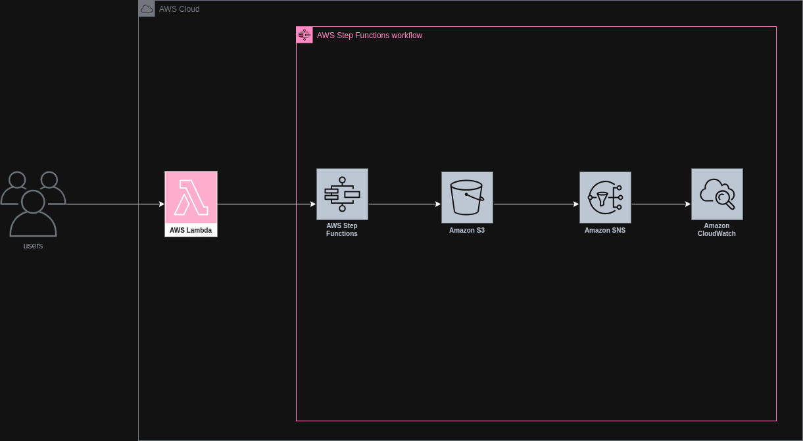

# Orquestração com AWS Step Functions (Desafio 02 — Bootcamp Santander Code Girls 2025)

## Sumário
- [Explicações](#explicações)
  - [O que é AWS Step Functions?](#o-que-é-aws-step-functions)
  - [O que é ECS?](#o-que-é-ecs)
  - [O que é EKS?](#o-que-é-eks)
  - [O que é Amazon SNS?](#o-que-é-amazon-sns)
  - [O que é Amazon SQS?](#o-que-é-amazon-sqs)
- [Arquitetura](#arquitetura)
  - [Explicação da Arquitetura](#explicação-da-arquitetura)
  - [Componentes Utilizados](#componentes-utilizados)
  - [Como implementar esse projeto no AWS Step Functions](#como-implementar-esse-projeto-no-AWS-Step-Functions)
- [Conceitos Fundamentais](#conceitos-fundamentais)
  - [Como criar um projeto com AWS Step Functions?](#como-criar-um-projeto-com-AWS-Step-Functions)
- [Fontes](#fontes)
---

## Explicações

### O que é AWS Step Functions?
AWS Step Functions é um orquestrador serverless de fluxos que coordena serviços e código por meio de estados e transições definidos em JSON usando a Amazon States Language. Você encadeia etapas como Task, Choice, Parallel, Map, Wait, Success e Fail com passagem de dados entre passos. Há dois modos de execução, Standard para processos longos com histórico completo e Express para altíssima taxa e baixa latência com custo por duração. Integra diretamente com serviços da AWS e chamadas do SDK, reduzindo a necessidade de Lambda, e suporta callbacks para passos humanos. Traz retries com backoff, tratamento de erros com Catch e timeouts, além de versionamento e aliases da state machine. A observabilidade inclui visualização do grafo, histórico de execuções, CloudWatch Logs e X Ray. Segurança é feita com IAM, criptografia e endpoints VPC. Casos comuns abrangem pipelines de dados, orquestração de microserviços, processamento paralelo de objetos no S3, ETL e automações operacionais.

### O que é ECS?
ECS é o Amazon Elastic Container Service, o orquestrador gerenciado de contêineres da AWS. Ele executa aplicações em contêineres Docker organizadas em clusters, onde você define “task definitions” e as executa como “tasks” ou “services” que mantêm o número de réplicas e fazem auto-healing. Há dois modos de execução: EC2, quando você gerencia as instâncias do cluster, e Fargate, quando a AWS gerencia a infraestrutura de forma serverless. Integra nativamente com ECR para imagens, IAM para permissões, ALB/NLB para tráfego, CloudWatch para logs e métricas, Secrets Manager e Parameter Store para segredos. Serve para APIs, workers, filas e jobs event-driven que precisam de portabilidade de contêiner, com menos operação que rodar Kubernetes e mais controle que funções Lambda.

### O que é EKS?
EKS é o Amazon Elastic Kubernetes Service, o serviço gerenciado de Kubernetes da AWS. A AWS opera o plano de controle do cluster e você executa workloads em nós gerenciados por você em EC2 ou de forma serverless com Fargate. Mantém total compatibilidade com o Kubernetes. Integra nativamente com VPC CNI para networking, IAM Roles for Service Accounts para permissões granulares, ECR para imagens, ALB/NLB via ingress controller, EBS/EFS para volumes e CloudWatch/Prometheus para observabilidade. Suporta Managed Node Groups, autoscaling com Cluster Autoscaler ou Karpenter e políticas de segurança com OPA/Gatekeeper. É indicado quando você precisa de Kubernetes puro, portabilidade entre ambientes e ecossistema k8s.

### O que é Amazon SNS?
Amazon SNS (Simple Notification Service) é o serviço gerenciado de mensagens da AWS no modelo pub/sub e de notificações push. Você publica uma mensagem em um tópico e o SNS entrega para um ou vários assinantes como filas SQS, funções Lambda, endpoints HTTP(S), e-mail, SMS e push móvel, permitindo forte desacoplamento entre produtores e consumidores. Oferece filtros por atributos da mensagem, tópicos FIFO para ordenação, retentativas com backoff, integração com DLQ via SQS, criptografia com KMS e controle de acesso por IAM e políticas do tópico, inclusive entre contas. O tamanho máximo da mensagem é 256 KB e o serviço escala automaticamente para altíssimos volumes. Casos comuns incluem broadcast de eventos para múltiplos sistemas, pipelines orientados a eventos, alertas operacionais e notificações a usuários. Em contraste com SQS, que é fila pull ponto-a-ponto, o SNS é push e multiponto.

### O que é Amazon SQS?
Amazon SQS (Simple Queue Service) é uma fila gerenciada do tipo pull. Produtores colocam mensagens e consumidores as leem de forma assíncrona, com invisibility timeout, DLQ, controle de concorrência e tipos Standard ou FIFO para ordenação e deduplicação. É comum integrar SNS → SQS para fan-out com desacoplamento e nivelamento de picos de carga.


## Arquitetura

* [Link da Arquitetura](https://drive.google.com/file/d/1Fvf7UR0KZ3RTW_aJzcGhS5NPNDJTobcX/view?usp=sharing)

### Explicação da Arquitetura
Usuários acionam uma Lambda de entrada que valida a requisição e inicia a execução do AWS Step Functions. A state machine orquestra o fluxo usando integrações nativas, primeiro gravando dados ou arquivos no Amazon S3 para armazenamento durável e versionado. Em seguida publica uma mensagem no Amazon SNS para notificar assinantes ou disparar consumidores em paralelo como emails, filas ou outros serviços. Todo o percurso é monitorado pelo Amazon CloudWatch, com logs, métricas e alarmes que facilitam diagnóstico e observabilidade. Esse desenho reduz a quantidade de código, centraliza retries e tratamento de erros no Step Functions e garante rastreabilidade ponta a ponta com histórico de execuções. As permissões do papel do Step Functions abrangem s3 PutObject e sns Publish enquanto a Lambda inicial precisa apenas iniciar a execução. Com criptografia via KMS e políticas de bucket e de tópico, o fluxo fica seguro, auditável e pronto para escalar.

### Componentes Utilizados

| Serviço           | Descrição                                           |
|-------------------|-----------------------------------------------------|
| Usuários          | Usuários que acessam a aplicação                    |
| Amazon Lambda     | Servidor serverless                                 |
| Aws Step Functions| Orquestração de fluxos de trabalho                  |
| Amazon S3         | Armazenamento de arquivos                           |
| Amazon SNS        | Serviço de mensagens                                |
| Amazon CloudWatch | Monitoramento do percurso                           |

### Como implementar esse projeto no AWS Step Functions?
1. Crie os recursos de apoio: um bucket S3 e um tópico SNS.
2. No Step Functions, escolha “Create state machine”, selecione o modo Standard.
3. Em “Definition”, cole uma ASL mínima que escreve no S3 e notifica no SNS.
4. Em “Permissions”, crie uma role para a state machine com acesso a s3:PutObject no bucket e sns:Publish no tópico, e ative logs no CloudWatch.
5. Execute com um input de teste.


## Conceitos Fundamentais
### Como criar um projeto com AWS Step Functions?
1. No console procure por AWS Step Functions
2. Arraste os recursos de acordo com a sua arquitetura
3. Adicione as configurações de implantação do serviço clicando em cima dele e expandindo o menu de implantação.

### Como testar a state machine
Exemplo via CLI:
```bash
aws stepfunctions start-execution \
  --state-machine-arn arn:aws:states:REGIAO:CONTA:stateMachine:MinhaStateMachine \
  --input '{"key":"exemplo.txt","payload":"hello world"}'
```

## Fontes
* [AWS Step Functions](https://aws.amazon.com/pt/step-functions/)
* [ECS](https://aws.amazon.com/pt/ecs/)
* [EKS](https://aws.amazon.com/pt/eks/)
* [Amazon SNS](https://aws.amazon.com/pt/sns/)
* [Amazon SQS](https://aws.amazon.com/pt/sqs/)
